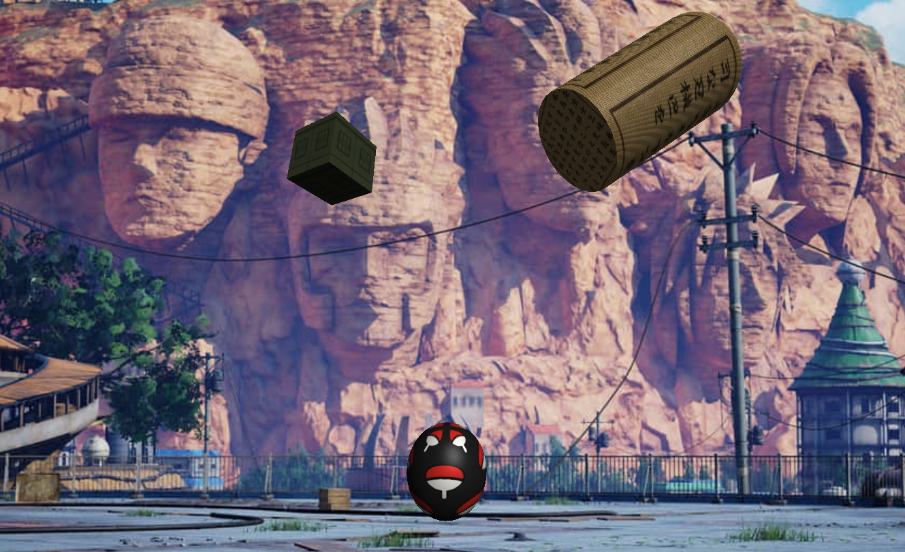

<h1 align="center"> Cena 3D - Projeto de Computação Gráfica </h1>

  Trabalho acadêmico desenvolvido como parte da disciplina de Computação Gráfica na graduação.  
  Projeto realizado com a biblioteca <strong>Three.js</strong>, explorando conceitos básicos de modelagem e visualização 3D na Web.

  <a href="#-tecnologias">Tecnologias</a>&nbsp;&nbsp;&nbsp;|&nbsp;&nbsp;&nbsp;
  <a href="#-projeto">Projeto</a>&nbsp;&nbsp;&nbsp;|&nbsp;&nbsp;&nbsp;
  <a href="#-execução">Execução</a>&nbsp;&nbsp;&nbsp;|&nbsp;&nbsp;&nbsp;
  <a href="#memo-licença">Licença</a>

  

 

  

## 🚀 Tecnologias

Esse projeto foi desenvolvido com as seguintes tecnologias:

- HTML e CSS
- JavaScript
- [Three.js](https://threejs.org/)
- VSCode

## 💻 Projeto

Este projeto tem como objetivo montar uma cena 3D básica com três objetos diferentes: um cubo, uma esfera e um cilindro.

A cena inclui:
- Texturas aplicadas aos objetos;
- Iluminação direcional e ambiente;
- Transformações como rotação e escala;
- Controle de câmera via mouse com `OrbitControls`;
- Efeito especial ativado pela tecla **K**.

O projeto faz parte da disciplina de Computação Gráfica, e foi idealizado para aplicar os conceitos vistos em aula.

- 🔗 [Acesse o projeto online](https://scene-3d.vercel.app/)

## ▶️ Execução

Para executar o projeto localmente:

1. Clone o repositório;
2. Instale uma extensão de live server no VSCode (ou use um servidor local);
3. Rode o arquivo `index.html` em um navegador.

## 📝 Licença

Este projeto é acadêmico e foi desenvolvido para fins educacionais.
